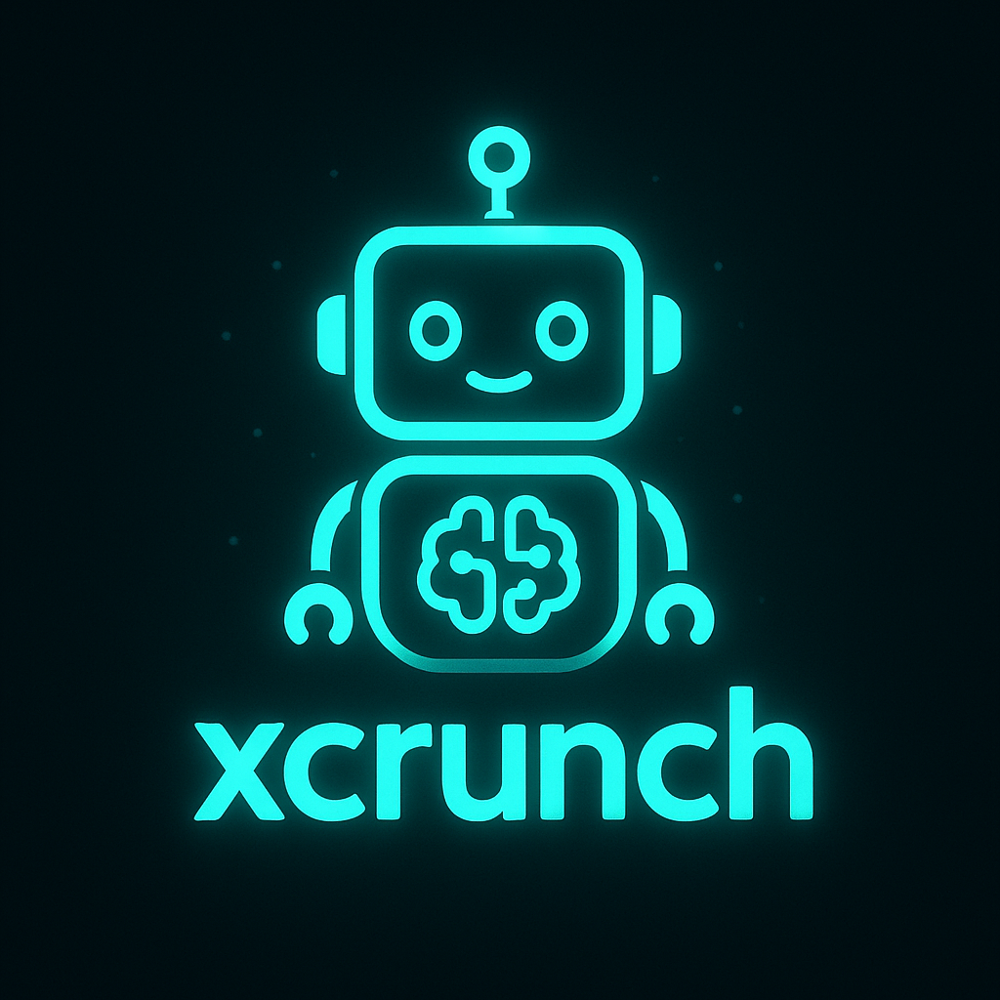

# XCrunchHub



## Your Trusted DeFi Platform

XCrunchHub is a comprehensive DeFi analytics platform that redefines finance through blockchain technology. Take control of your financial future with advanced analytics, security tools, and comprehensive DeFi management.

📺 **Watch our Demo Video**: [XCrunchHub Demo](https://www.youtube.com/watch?v=ZoMBdVoQzlU)

## Features

### Token Analysis
- Comprehensive token analysis with price history, market cap, and trading volume
- DeFi safety scores to assess risk
- Multi-chain support (Ethereum, Polygon, Avalanche, Linea)
- Detailed technical analysis

### Pool Details
- Detailed DeFi pool analysis with liquidity metrics
- Yield calculations and historical performance
- Risk assessment for liquidity pools
- Multi-chain support for all major DeFi protocols

### AI Analytics
- Wallet analysis to understand holdings and patterns
- NFT collection performance metrics
- Risk forensics to identify potential threats
- Predictive analytics for market movements

### Fraud Detection
- Multi-language support for global users
- Real-time security alerts for suspicious activities
- Contract analysis to identify vulnerabilities
- Risk assessment reports for NFT projects and wallet addresses

### NFT Market Analytics
- Security auditing of NFT collections
- Whale tracking to monitor large holder movements
- Market analysis and trend identification
- Comprehensive dashboards with visual data representation

### Telegram Bot Integration
- AI-powered NFT Copilot Bot accessible at [@xcrunch_bot](https://t.me/xcrunch_bot)
- Real-time alerts directly to your Telegram for price movements and security threats
- AI analysis of market opportunities with personalized recommendations
- Investment advice based on your portfolio holdings and market conditions
- Instant notifications for suspicious activities in your connected wallets
- Multi-language support for global accessibility
- Interactive commands for on-demand analytics and insights

## Core Principles

1. **Full Transparency**: Public ledger accountability
2. **Military-grade Security**: Advanced security protocols
3. **AI-Powered Analytics**: Make informed decisions with AI assistance
4. **Multi-Chain Support**: Ethereum, Polygon, Avalanche, and Linea networks

## API Integration

XCrunchHub leverages powerful APIs to deliver comprehensive blockchain analytics:

### Backend API Endpoints

- **/Token** - Fetches token data across multiple blockchains with caching mechanism
- **/Pool** - Retrieves pool data with detailed liquidity metrics
- **/Token/:blockchain/:tokenId** - Gets detailed token metrics for specific tokens
- **/pooldetails/:blockchain/:pairAddress** - Provides comprehensive pool analytics
- **/poolmetadata/:blockchain/:pairAddress** - Delivers metadata for DeFi pools
- **/api/wallet-balance/:address** - Analyzes wallet holdings across multiple chains

### External API Integrations

- **UnleashNFTs API** - Powers our NFT analytics and blockchain data
- **Etherscan API** - Provides transaction and contract verification data
- **Google Generative AI** - Enhances our AI analytics capabilities
- **Groq API** - Powers advanced natural language processing for insights

## Project Structure

```
├── Backend/            # Backend API services
├── Subscription.sol    # Smart contract for subscription management
├── animation/          # Animation assets for the UI
├── artifacts/          # Smart contract artifacts
└── thirdweb-app/       # Frontend application
    ├── src/
    │   ├── App.jsx     # Main application component
    │   ├── assets/     # Static assets
    │   ├── components/ # UI components
    │   └── ...         # Other source files
    └── ...             # Configuration files
```

## Getting Started

### Prerequisites

- Node.js (v14 or higher)
- npm or yarn
- MetaMask or other Web3 wallet

### Installation

1. Clone the repository
   ```bash
   git clone https://github.com/yourusername/XCrunchHub.git
   cd XCrunchHub
   ```

2. Install dependencies for the frontend
   ```bash
   cd thirdweb-app
   npm install
   # or
   yarn install
   ```

3. Install dependencies for the backend
   ```bash
   cd ../Backend
   npm install
   # or
   yarn install
   ```

4. Set up environment variables
   - Create a `.env` file in the `thirdweb-app` directory based on the `.env.example` template
   - Create a `.env` file in the `Backend` directory based on the `.env.example` template

### Running the Application

1. Start the backend server
   ```bash
   cd Backend
   npm run dev
   # or
   yarn dev
   ```

2. Start the frontend application
   ```bash
   cd thirdweb-app
   npm run dev
   # or
   yarn dev
   ```

3. Open your browser and navigate to `http://localhost:5173`

## Smart Contract Integration

XCrunchHub utilizes blockchain technology for secure and transparent subscription management:

### Subscription Smart Contract

Our `Subscription.sol` contract manages user subscriptions with the following features:

- **Flexible Subscription Plans**: Weekly, monthly, and yearly options with different pricing tiers
- **Automatic Duration Management**: Extends existing subscriptions or creates new ones
- **Transparent Pricing**: All subscription costs are publicly visible on the blockchain
- **Owner Controls**: Allows for price updates and fund management by contract owner
- **Event Logging**: Emits events for subscriptions, price updates, and withdrawals for full transparency

```solidity
// Key functions include:
function subscribe(uint8 _plan) external payable;
function isSubscribed(address _user) external view returns (bool);
function updatePrices(uint256 _priceWeek, uint256 _priceMonth, uint256 _priceYear) external onlyOwner;
```

## Subscription Model

XCrunchHub offers flexible subscription options to access premium features:
- Weekly plans for short-term needs (0.01 ETH)
- Monthly subscriptions for regular users (0.03 ETH)
- Annual plans with the best value (0.3 ETH)

All subscriptions are managed through our secure blockchain-based subscription system, ensuring transparency and control over your membership.

## Technologies Used

- **Frontend**: React, Tailwind CSS, Vite
- **Backend**: Node.js, Express
- **Blockchain**: Ethereum, Polygon, Avalanche, Linea
- **Smart Contracts**: Solidity
- **Web3 Integration**: Thirdweb SDK
- **Data Visualization**: Recharts, D3.js

## Contributing

We welcome contributions to XCrunchHub! Please feel free to submit a Pull Request.

## License

This project is licensed under the MIT License - see the LICENSE file for details.

## Creators

### Ronak Agrawal
- **GitHub**: [Ronak2027](https://github.com/Ronak2027)
- **LinkedIn**: [Ronak Agrawal](https://linkedin.com/in/ronak-agrawal-556657288)

### Mayur Wagh
- **GitHub**: [MayurWagh66](https://github.com/MayurWagh66)
- **LinkedIn**: [Mayur Wagh](https://linkedin.com/in/mayur-wagh2628)

## Contact

For any inquiries, please reach out to us at contact@xcrunchhub.com

---

© 2024 XCrunchHub. All rights reserved.


